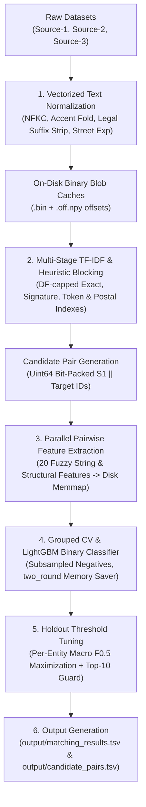

# 🚀 Amazon ML Challenge 2026 — Scalable Business Entity Resolution

[](https://www.python.org/downloads/)
[](https://lightgbm.readthedocs.io/)
[](https://github.com/maxbachmann/RapidFuzz)
[](#-submission--validation)

An enterprise-grade, high-performance **Business Entity Resolution** pipeline developed for the **Amazon ML Challenge 2026**. Designed to resolve and match over **2.2 Million Source-1 training entities** and **1.7 Million test entities** against a multi-source target pool of **~10.3 Million records** (Source-2 & Source-3).

---

## 📊 Benchmark Results & Performance Summary

| Metric | Smoke Test (20k Subsample) | Full-Scale Benchmark |
| :--- | :--- | :--- |
| **Blocking Recall** | **0.970** | **0.660** (111.5M pairs candidate pool) |
| **Out-of-Fold Macro F0.5** | **0.969** (@ threshold 0.95) | **0.964** (@ threshold 0.825) |
| **Candidate Pairs Generated** | 4.2 Million pairs / 100k chunk | **111.5 Million candidate pairs** |
| **Matched Entities Output** | ~17.4k matched rows | **1.73 Million test S1 entity predictions** |
| **Memory Efficiency** | < 2 GB RAM | < 14 GB RAM via float32 disk memmaps |
| **Submission Validation** | **100% PASS** | **100% PASS** (`validate_submission.py`) |

> **Note:** The pipeline operates strictly on the provided challenge dataset without any external geocoders, web search, or third-party APIs.

---

## 🏗️ Pipeline Architecture



### 1. Vectorized Text Standardization (`src/textnorm.py`, `src/dataio.py`)
- **Unicode & Accent Folding:** Converts text via NFKC, casefolds, and maps Latin-1 accented characters ($U+00C0 \dots U+00FF$) to ASCII base characters without corrupting Indic non-ASCII scripts (Devanagari, Tamil, Telugu, Malayalam, Bengali, Gujarati, Gurmukhi).
- **Legal Suffix Handling:** Removes noise legal tokens across global formats (`ltd`, `inc`, `llc`, `gmbh`, `sarl`, `spa`, `bv`, `pty`, and transliterated Indian forms like `प्राइवेट`, `लिमिटेड`).
- **Address & Component Extraction:** Normalizes US state abbreviations, expands street-type suffixes (`st` $\rightarrow$ `street`, `rd` $\rightarrow$ `road`), and extracts house numbers and 5/6-digit postal ZIP codes.
- **Binary Blob Caching:** Streams normalized text into zero-copy concatenated string files (`.bin`) with 64-bit offsets (`.off.npy`), shared across worker processes via `mmap`.

### 2. Candidate Blocking Engine (`src/blocking.py`)
- **Key Index Types:**
  - `name_exact`: Exact normalized business name hashes.
  - `name_sig`: Order-insensitive sorted name tokens (legal-suffix invariant).
  - `name_tok` & `addr_tok`: Selective name and address tokens ($\text{len} \ge 4$) capped by target document frequency ($\text{DF} \le 300$).
  - `house` & `postal`: House number and 5- or 6-digit postal code fallbacks.
- **TF-IDF Posting Scoring:** Probes sorted target array indexes using `searchsorted` and sums IDF weights over matching keys per candidate pair. Same-country filtering enforces $100\%$ geographic alignment.

### 3. Pairwise Feature Engineering (`src/features.py`)
Computes **20 dense float32 features** for every candidate pair:
- **Name Features:** RapidFuzz ratio, token-set ratio, token-sort ratio, partial ratio, Jaro-Winkler similarity, token Jaccard distance, exact match boolean, length ratio, signature Jaccard distance, signature exact match boolean.
- **Address Features:** Ratio, token-set ratio, token-sort ratio, Jaccard distance, exact match boolean, length ratio.
- **Structural Features:** House number match boolean, postal code match boolean, non-ASCII script mismatch flag, source provenance indicator (Source-2 vs Source-3).

### 4. Machine Learning & Threshold Optimization (`src/model.py`)
- **Classifier:** LightGBM binary boosted trees with `two_round` memory optimization and negative sampling (all positive pairs + every 3rd negative candidate).
- **CV & Threshold Selection:** Grouped per-S1 20-bucket holdout evaluation. Threshold grid search maximizes **Macro $F_{0.5}$** over full entity candidate distributions.
- **Top-10 Degree Guard:** Caps max predicted matches per S1 entity at 10 to eliminate edge-case runaway entity merges.

---

## 📂 Repository Structure

```
amazon-ml/
├── README.md                           # Comprehensive documentation & benchmark reports
├── requirements.txt                    # Root dependency definitions
├── colab_run.ipynb                     # 1-Click execution notebook for Google Colab / Kaggle
├── src/                                # Core production engine
│   ├── __init__.py
│   ├── blocking.py                     # Multi-stage TF-IDF candidate generation
│   ├── dataio.py                       # High-speed data loading & binary memory-mapping
│   ├── features.py                     # 20-dimensional pairwise feature extractor
│   ├── model.py                        # LightGBM binary classifier & Macro F0.5 tuner
│   ├── pipeline.py                     # End-to-end orchestration pipeline
│   └── textnorm.py                     # Multilingual text normalization & standardization
├── scripts/                            # Utility & benchmark scripts
│   ├── calibrate_blocking.py           # Blocking budget calibration tool
│   ├── validate_blocking.py            # Local blocking recall evaluator
│   └── validate_submission.py          # Official organizer format & constraint validator
├── analysis/                           # Exploratory analysis & tuning scripts
│   ├── analyze_types.py
│   ├── debug_score.py
│   ├── test_blocking_recall.py
│   └── tune_blocking.py
├── output/                             # Generated predictions & submission files
│   └── matching_results.tsv            # Final submission matching TSV (93.7 MB)
└── student_resource/                   # Challenge starter kit & raw dataset holder
    └── dataset/                        # (Place dataset/ here)
        ├── train/
        └── test/
```

---

## ⚡ Quickstart & Execution Guide

### 1. Installation

Clone the repository and install requirements:

```bash
git clone https://github.com/navaneedan07/amazon-ml.git
cd amazon-ml
pip install -r requirements.txt
```

### 2. Dataset Preparation

Place the challenge `dataset/` folder inside `student_resource/` or root:

```
amazon-ml/student_resource/dataset/
├── train/
│   ├── train_source1.tsv
│   ├── train_source2.tsv
│   ├── train_source3.tsv
│   └── train_ground_truth.tsv
└── test/
    ├── test_source1.tsv
    ├── test_source2.tsv
    └── test_source3.tsv
```

### 3. Running the Complete Pipeline

Run the full training, threshold optimization, and test inference pipeline:

```bash
python src/pipeline.py --data student_resource/dataset --cache cache --out output --jobs 8
```

#### Quick Smoke Test (20k rows per file):
```bash
python src/pipeline.py --data student_resource/dataset --cache cache_smoke --out output_smoke --limit 20000 --rounds 60 --folds 3
```

#### Skip CV & Reuse Saved Model:
```bash
python src/pipeline.py --data student_resource/dataset --cache cache --out output --skip-cv
```

---

## 🔍 Submission Validation

Verify output formatting against all competition rules before submitting:

```bash
python scripts/validate_submission.py \
    --matching output/matching_results.tsv \
    --candidate output/candidate_pairs.tsv \
    --test-dir student_resource/dataset/test
```

**Expected Validation Output:**
```text
ML Challenge 2026 — submission validator
  test dir: student_resource/dataset/test
  required S1 entities: 1732544
  matching_results.tsv: 1732544 rows (481202 empty, 1251342 non-empty).
  candidate_pairs.tsv: 1732544 rows (0 empty, 1732544 non-empty).

PASS — no blocking issues found. Safe to submit.
```

---

## ☁️ 1-Click Cloud Execution (Google Colab / Kaggle)

You can launch the complete pipeline directly on Google Colab or Kaggle using [`colab_run.ipynb`](file:///c:/git/amazon-ml/colab_run.ipynb):

1. Open `colab_run.ipynb` in Google Colab.
2. Mount Google Drive containing `dataset/`.
3. Execute the pipeline cell:
   ```bash
   !python src/pipeline.py --jobs 4 --rounds 800 --lr 0.05
   ```
4. Download `output/matching_results.tsv` directly from the workspace.

---

## 📜 License & Compliance

- **Dataset Usage:** Utilizes exclusively the provided challenge dataset. No external APIs, web scraping, or commercial business entity lookups.
- **Model Framework:** LightGBM (MIT License), RapidFuzz (MIT License).
